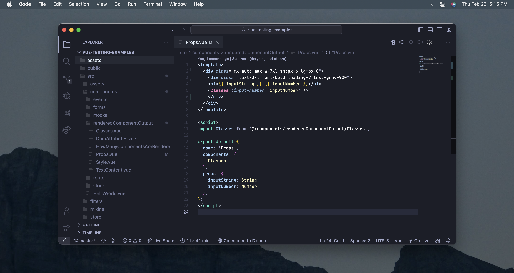

<p align="middle">
  
  
</p>

poimandres-vue is a version of the [poimandres](https://github.com/drcmda/poimandres-theme) theme for vs code with improved vue syntax styling.

to be honest, i have never made a vs code theme before, so i have no idea what I'm doing. i just wanted pretty colors for my vue code. it works for me but use at your own risk lol.

#### Contribute

    git clone https://github.com/brandonsaldan/poimandres-vue
    cd poimandres-vue
    npm install
    npm run dev

Go to `Run and Debug`, click the ▶ icon, any change you make in `src/theme.js` will now be reflected when you save.

## Related

- [poimandres-alacritty][poimandres-alacritty]: Alacritty version
- [poimandres-iterm][poimandres-iterm]: Iterm version
- [poimandres-kitty][poimandres-kitty]: Kitty version
- [poimandres-nvim][poimandres-nvim]: Neovim version

[poimandres-alacritty]: https://github.com/z0al/poimandres-alacritty
[poimandres-iterm]: https://github.com/alii/poimandres-iterm
[poimandres-kitty]: https://github.com/guilhermedeandrade/poimandres-kitty
[poimandres-nvim]: https://github.com/olivercederborg/poimandres.nvim

### Hyper theme

```bash
hyper i hyper-pmndrs
```